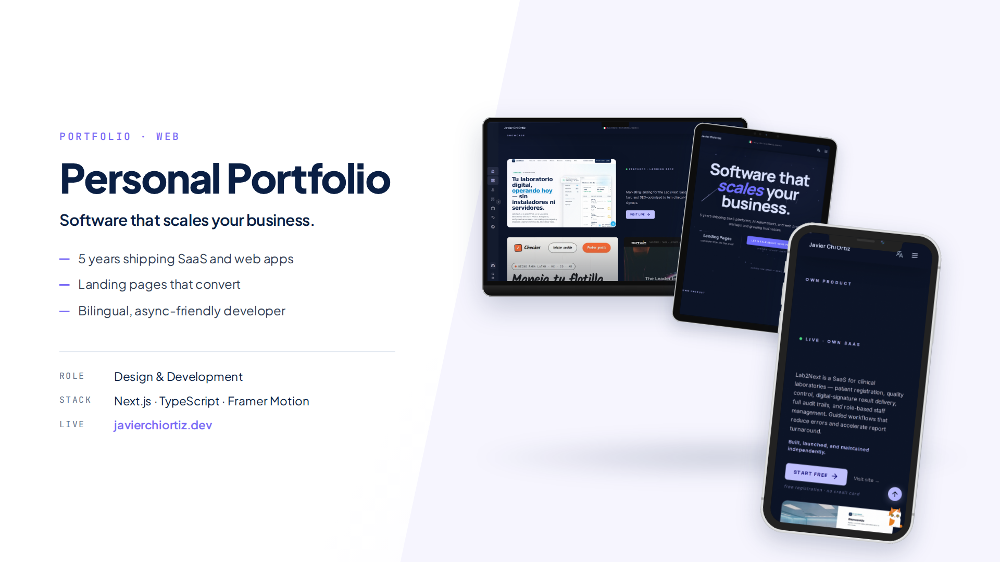
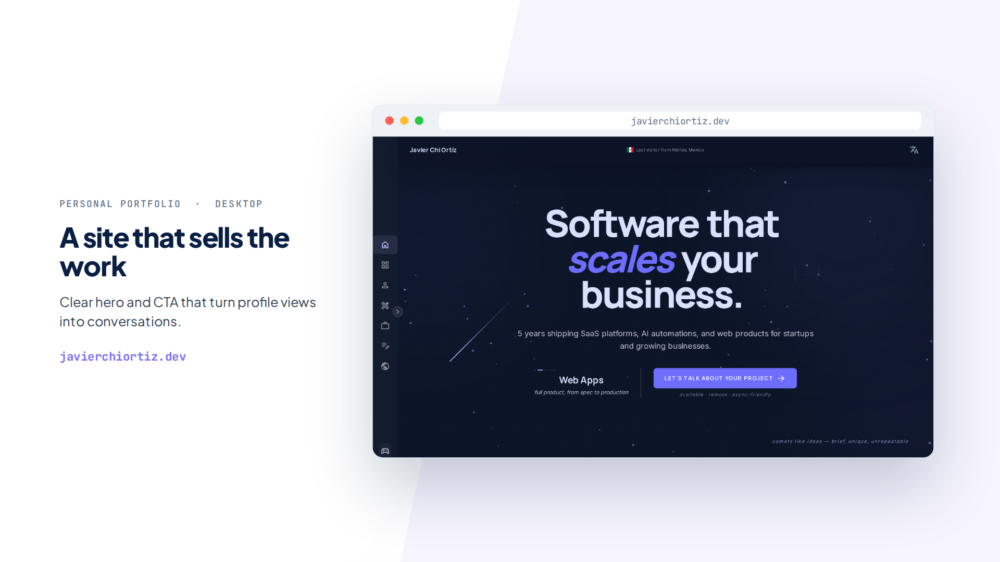
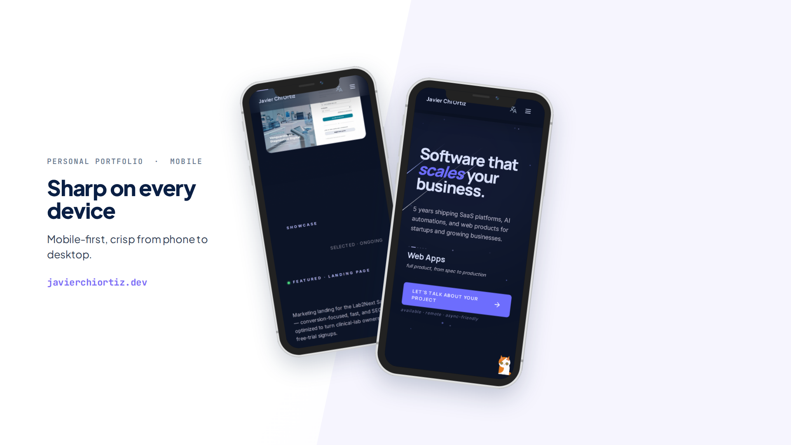
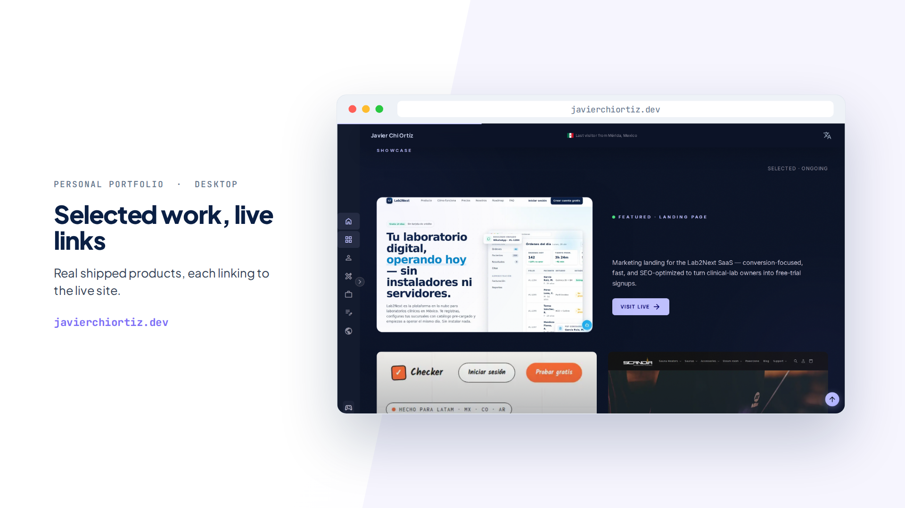
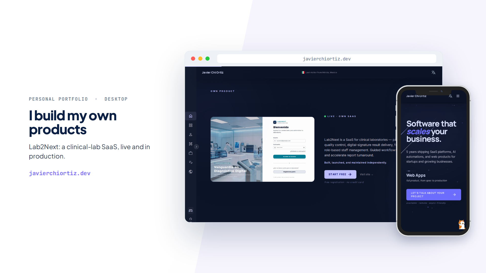
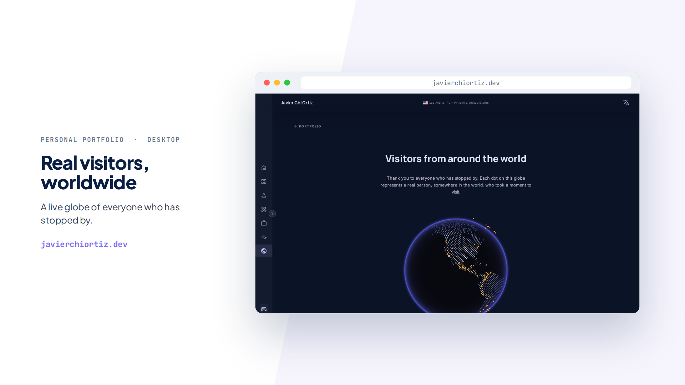

# javierchiortiz.dev

My personal site, designed and built from scratch. Live at [**javierchiortiz.dev**](https://javierchiortiz.dev/en).



## The idea

I translate Figma designs into production interfaces for a living, so my own site had to be exactly that: my design, my code, pixel by pixel. No template, no theme.

It is also a time machine. Every year I redesign it, but instead of deleting the old version I keep it running: the 2026 redesign lives at `/`, the 2025 one at `/2025`. You can literally browse how my design and my code have evolved. Most portfolios show your best moment; mine also shows the path.

And honestly, it is my playground. Half the features below exist because I wanted to learn something or because building them was fun, not because a portfolio needs a Marvel Rivals stats widget. (It doesn't. I have one anyway.)

## What's inside

- **EN/ES internationalization** with locale routing (next-intl), because my audience is both US recruiters and people here in México
- **Blog with its own CMS**: Supabase backed, with an authenticated admin panel at `/admin` where I write and publish
- **Visitor tracking done for fun**: a live globe of real visitors, a "last visitor" chip in the header, and a session counter in the footer
- **Dark/light mode** (next-themes), Manrope + Inter via next/font
- **Live toys**: Marvel Rivals stats widget and Discord presence via Lanyard
- **Automated project screenshots** with Puppeteer, so project cards never go stale

## A quick tour

| Desktop | Mobile |
| ------- | ------ |
|  |  |

| Selected work, live links | Own products in production |
| ------------------------- | -------------------------- |
|  |  |

Every dot on this globe is a real person who stopped by:



## Stack

Next.js 15 (App Router) · React 19 · TypeScript · Tailwind CSS v4 (CSS `@theme`, no config file) · Supabase · SWR · pnpm · Turbopack

## Routes

| Route    | Content                         |
| -------- | ------------------------------- |
| `/`      | 2026 redesign                   |
| `/2025`  | Legacy 2025 design, still alive |
| `/blog`  | Blog                            |
| `/admin` | CMS (authenticated)             |

## Run it locally

```bash
pnpm install
pnpm dev
```

Create a `.env.local` with:

```
NEXT_PUBLIC_SUPABASE_URL=
NEXT_PUBLIC_SUPABASE_ANON_KEY=
SUPABASE_SERVICE_ROLE_KEY=
MARVEL_RIVALS_API_KEY=
```

## Commands

```bash
pnpm dev      # dev server (Turbopack)
pnpm build    # production build
pnpm lint     # ESLint
pnpm format   # Prettier
```

## License

MIT

---

Designed and built by [Javier Chi Ortiz](https://javierchiortiz.dev/en) in Mérida, México. The same care I put into client UIs, applied to my own corner of the internet.

<!-- Repo "About" field:
Description: "My portfolio, designed and built from scratch. Next.js 15, React 19, Supabase. Past versions still live."
Website: https://javierchiortiz.dev
Topics: nextjs, react, typescript, tailwind, supabase, portfolio, i18n
-->
